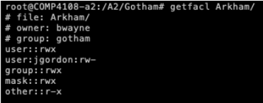

## Part A - File System Permissions

**Q1: Write a bash function to convert a GID to a group name using the Linux group file**

```bash
#!/bin/bash

gidSearch()
{
	cat /etc/group | grep -w $1 | cut -d : -f1
}
```

One would need to run ```source <script-name>.sh``` bring this script into the context of the current shell. 
Alternative would be to add “export PATH = $PATH:$pwd” in your bashrc so current parent shell can find the command gidSearch

Here is how the invocation looks like

```bash
comp4108@node00:$ gidSearch 100
users

comp4108@node00:$ gidSearch 45
sasl
```

**Q2 Write a command to change all the directories with permissions 777 in /A2/Haystack to have permissions 750 instead**

```diff
> sudo find . -type d -perm 777 -exec chmod 750 {} \;
```

In the command above, ```\;``` is for escaping the ```;``` character so bash does not interpret it as a command delimeter

**Q3 Find all the binary files in /usr/bin with the setuid bit set.**

```diff 
> find . -perm /4000
```

000 refers to the regular permission bits and 4 refers to the setuid bit. / means find files with at least one bit set from 4000.

## Part B - Access Control Lists

/A2/Gotham has following directory tree: 

```
Gotham
|
|-- Arkham
|
|-- GothamPD
|
'-- WayneManor
    |
    |-- Batcave
    |
    '-- MasterBedroom
```

**1. Give the ACL for the top level Gotham directory** 
```diff 
> getfacl /A2/Gotham
``` 

**2. Use chmod to add rx permissions for the other category to Gotham and ALL its sub-directories.** 
```diff
> chmod o+rx -R /A2/Gotham
```

**3. Use setfacl to add read and write permissions to Gotham, Arkham and GothamPD for the user jgordon**
```diff
> setfacl -m jgordon:rw /A2/Gotham/ /A2/Gotham/Arkham/ /A2/Gotham/GothamPD/
```

**4. Use setfacl to add read, write, and execute permissions toWayneManor, Batcave and MasterBedroom for the user bwayne** 
```diff
> setfacl -m bwayne:rwx /A2/Gotham/WayneManor/ /A2/Gotham/WayneManor/Batcave/ /A2/Gotham/WayneManor/MasterBedroom/ 
```

**5. Use setfacl to remove the ACL entries on Arkham for the users skyle and ocobblepot** 
```diff
> setfacl -x u:ocobblepot Arkham/
> setfacl -x u:skyle Arkham/
```

Results after removing ACL entries: 



**6. Give the ACL for all subdirectories of Gotham.** 
```diff
> find /A2/Gotham/ -type d -exec getfacl {} \; 
```

## Part C - Race Conditions - TOCTOU 

### Slow (Easy difficulty) 
```diff 
- Skeleton code is provided in Racing folder
```

This involves learning to exploit a classic time of check versus time of use (ToCToU) vulnerability in order to gain root access on the VM. We are given 2 files 

```root_file``` is owned by root and has no write permissions for any other users. 

```
student@COMP4108-a2:/A2/Racing/Slow$ ls -l root_file
-rw-r--r-- 1 root root 319 Sep 14  2012 root_file
```

```vuln_slow``` binary has setuid bit set 
```
student@COMP4108-a2:/A2/Racing/Slow$ ls -l vuln_slow
-rwsrwsr-x 1 root root 9116 Sep 14  2012 vuln_slow
```

It takes two arguments: a delay in seconds and a message to write to a debug file.

```
student@COMP4108-a2:/A2/Racing/Slow$ ./vuln_slow
Syntax: ./vuln_slow [delay seconds] [message]
```

vuln_slow binary works by checking the permissions on its debug file, sleeping for the provided number of seconds, and then writing to the debug file. 

Our objective is to exploit vuln_slow into writing a message you provide into root_file.

WRITEUP: 


